# 社群產品說明書

**版本**：2026-05 月版  
**涵蓋期間**：2025-12 ~ 2026-05（呈現此區間累積至今的產品狀態）  
**文件性質**：以商業 / 產品邏輯為主軸，不涉及技術實作細節  

---

## 目錄

- [0. 總覽 Executive Summary](#0-總覽-executive-summary)
- [1. 產品定位](#1-產品定位)
- [2. 使用者維度 — 商業旅程](#2-使用者維度--商業旅程)
- [3. PM 維度 — 功能模組地圖](#3-pm-維度--功能模組地圖)
- [4. 半年累積能力總覽](#4-半年累積能力總覽)
- [5. 產品邊界與限制](#5-產品邊界與限制)
- [6. 附錄](#6-附錄)

---

## 0. 總覽 Executive Summary

> 一頁讀懂這個產品：是什麼、給誰、怎麼運作、最近半年發生什麼。

**這是什麼**  
本產品是嵌入在 **BingoPlus / SharePlus** 主站內的**社群模組**——讓玩家在玩遊戲之餘，能瀏覽內容、發表動態、互動社交、領取任務獎勵，並參與營銷活動。

**給誰用**  
主站既有玩家，特別是有社交與分享傾向、願意產生 UGC（用戶生成內容）的高頻使用者。

**核心商業循環**

```
拉新 ──► 留存 ──► 活躍 ──► 變現 ──► 召回 ──► 拉新（循環）
 │        │        │        │        │
裂變    任務     互動     導流回    推播
活動    領獎     UGC      主站     通知
```

**半年下來累積的四大成果軸**

| # | 成果軸 | 主要已上線能力 | 對應商業價值 |
|---|---|---|---|
| ① | **沉浸式內容體驗** | 雙欄 / 單欄兩種瀑布流；沉浸式短影片；合集 | 瀏覽時長、內容黏著 |
| ② | **每日任務體系** | 每日任務、連續任務、領獎體驗、任務風控 | DAU、留存 |
| ③ | **社群基礎建設** | 通知中心兩層架構（頻道 / 訊息）、全場景站內訊息、追蹤與新粉絲提示 | 召回率、社交網絡密度 |
| ④ | **營銷活動矩陣** | 金剛區（TAROT / 每日任務 / 遊戲測評 / 遊戲偏好分析 / 排行榜 5 個常駐入口）、九宮格裂變、品牌故事、世界盃、Carlo | 拉新、季節性運營、IP 合作 |

---

## 1. 產品定位

### 1.1 產品形態

本社群模組不是一個獨立 App，而是**嵌入在 BingoPlus / SharePlus 主站內**的子模組。玩家透過主站的某個入口（如底部 Tab、活動 Banner、推播訊息）進入社群，使用者身份由主站直接帶入，**不需要重新註冊或登入**。

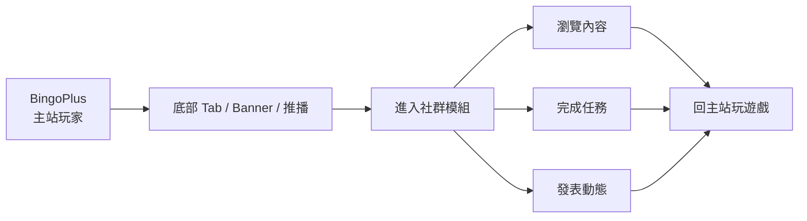
```mermaid
flowchart LR
    A[BingoPlus<br/>主站玩家] --> B[底部 Tab / Banner / 推播]
    B --> C[進入社群模組]
    C --> D[瀏覽內容]
    C --> E[完成任務]
    C --> F[發表動態]
    D --> G[回主站玩遊戲]
    E --> G
    F --> G
```

對玩家而言，社群與主站是「同一個體驗的不同面向」：主站打遊戲、社群聊遊戲，兩者互相導流。

### 1.2 目標受眾

| 受眾類型 | 在社群中的行為 | 對商業價值的貢獻 |
|---|---|---|
| **高頻遊戲玩家** | 看別人的遊戲分享、追蹤其他玩家、領每日任務獎勵 | 留存、活躍 |
| **內容創作者（PUGC）** | 發遊戲心得、贏分截圖、影片合集 | 內容供給、社群活力 |
| **對社群陌生的主站玩家** | 透過裂變活動連結或主站入口進到社群，看排行榜、追蹤熱門帳號（玩家身份仍由主站帶入） | 拉新轉化（社群內活躍） |
| **沉睡用戶** | 透過通知 / 推播被召回 | 召回率 |

### 1.3 商業價值定位

社群模組在主站生態中扮演三個角色：

1. **黏著層**：用內容與社交把玩家留在 App 內，延長 session 時長
2. **拉新層**：透過分享、裂變、邀請機制把現有玩家的社交網絡轉為新用戶
3. **召回層**：透過即時訊息與通知把流失玩家帶回 App

**首頁進入後第一眼**

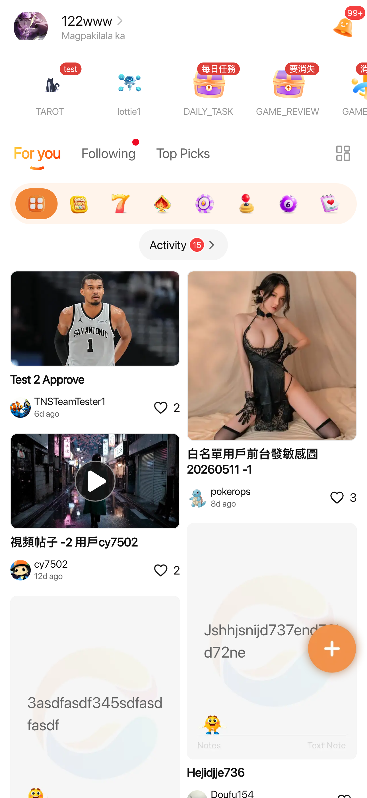

---

## 2. 使用者維度 — 商業旅程

> 用「玩家一天在 App 內會做什麼」串起所有功能。每個階段標註對應的商業價值。

### 2.0 一日旅程總覽

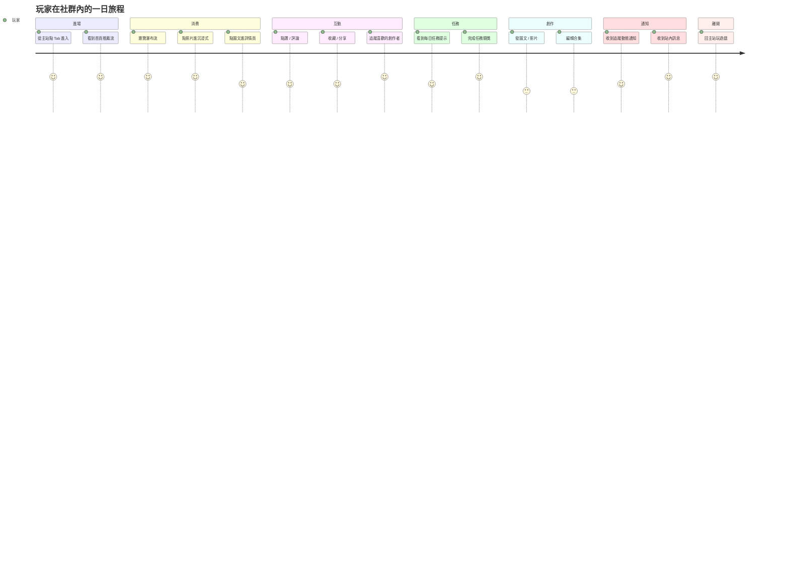
```mermaid
journey
    title 玩家在社群內的一日旅程
    section 進場
      從主站點 Tab 進入: 5: 玩家
      看到首頁推薦流: 5: 玩家
    section 消費
      瀏覽瀑布流: 5: 玩家
      點影片進沉浸式: 5: 玩家
      點圖文進詳情頁: 4: 玩家
    section 互動
      點讚 / 評論: 4: 玩家
      收藏 / 分享: 4: 玩家
      追蹤喜歡的創作者: 5: 玩家
    section 任務
      看到每日任務提示: 4: 玩家
      完成任務領獎: 5: 玩家
    section 創作
      發圖文 / 影片: 3: 玩家
      編輯合集: 3: 玩家
    section 通知
      收到追蹤動態通知: 4: 玩家
      收到站內訊息: 5: 玩家
    section 離開
      回主站玩遊戲: 5: 玩家
```

---

### 2.1 進場：玩家從哪來、第一眼看到什麼

**商業價值**：拉新 / 跨模組導流

**進入路徑**  
玩家從主站三種入口進入社群：
- **底部 Tab**：主站底部固定的「社群」分頁（高頻入口）
- **活動 Banner**：主站首頁活動位推廣特定社群內容（短期運營入口）
- **推播 / 站內訊息**：玩家收到推播或站內訊息點擊進入（召回入口）

**進入後第一眼**  
玩家落地在**首頁**，預設看到：
- **金剛區（首頁頂部活動入口 Banner）**：常駐運營活動入口，可橫向滑動。目前包含的入口：
  - **塔羅牌（TAROT）**：新手趣味互動
  - **每日任務（DAILY_TASK）**：留存核心引擎
  - **遊戲測評（GAME_REVIEW）**：玩家對遊戲的評價內容
  - **遊戲偏好分析（GAME_DNA）**：建立個人遊戲偏好標籤
  - **排行榜（RANKING）**：玩家排名與競爭運營
  - 部分入口會帶 **Hot / New** 等狀態標籤
- **頂部分類列**：不同遊戲類型 / 主題分頁（精選 / 追蹤 / 遊戲類型）
- **主體區瀑布流推薦內容**（混合圖文、影片、合集）
- 賽事或主題活動期間，頂部會替換為對應主題背景（例：世界盃情報背景僅在賽事活動期間展示，非長駐 UI）

**對 PM 的設計重點**  
玩家進場「零摩擦」是社群留人的關鍵。沒有登入頁、沒有歡迎彈窗（除非有特定運營活動需要），玩家來了就直接看到內容。

**首頁畫面**：金剛區（頂部活動入口 Banner）、分類列、瀑布流卡片

| 首頁（畫面初始可見） | 金剛區橫向滑動後 |
|---|---|
|  | 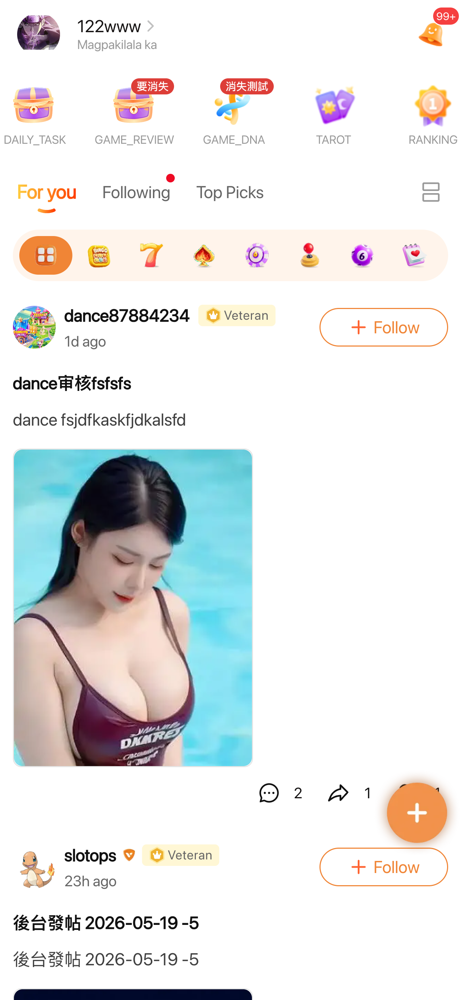 |

---

### 2.2 內容消費：feed → 沉浸式 → 詳情頁

**商業價值**：留存 / 黏著 / 時長

這是整個社群模組**最核心的場景**，玩家絕大多數的瀏覽時間都花在這個流程上。

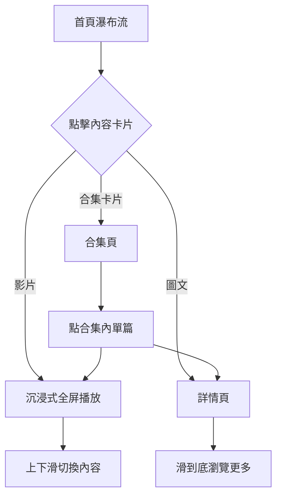
```mermaid
flowchart TD
    A[首頁瀑布流] --> B{點擊內容卡片}
    B -- 影片 --> C[沉浸式全屏播放]
    B -- 圖文 --> D[詳情頁]
    B -- 合集卡片 --> E[合集頁]
    C --> F[上下滑切換內容]
    D --> G[滑到底瀏覽更多]
    E --> H[點合集內單篇]
    H --> C
    H --> D
```

**首頁瀑布流（Feed）**  
- 不等高卡片左右錯落呈現（瀑布流佈局）
- 內容混合：圖文帖子、短影片、合集封面、贏分分享、品牌故事卡片
- 滑到底自動載入下一批
- 支援頂部分類切換（如：精選 / 遊戲類型 A / 遊戲類型 B / 追蹤）

**沉浸式（Immersion）**  
- 點影片內容後進入全屏播放
- 上下滑切換到下一個影片（類 TikTok 體驗）
- 螢幕左下顯示作者頭像、暱稱、Follow 按鈕
- 螢幕右下橫向排列互動按鈕（留言、分享、讚）
- 底部固定留言輸入框，可直接留言

**詳情頁**  
- 點圖文內容進入完整閱讀
- 含完整圖文、互動區、評論區、相關推薦

**合集頁**  
- 創作者打包多篇內容形成的集合
- 玩家可逐篇瀏覽，享受連續性內容體驗

**瀑布流呈現方式（雙瀑布流 / 單瀑布流）**

| 雙瀑布流（兩欄不等高錦拼） | 單瀑布流（單欄全寬卷動） |
|---|---|
|  | 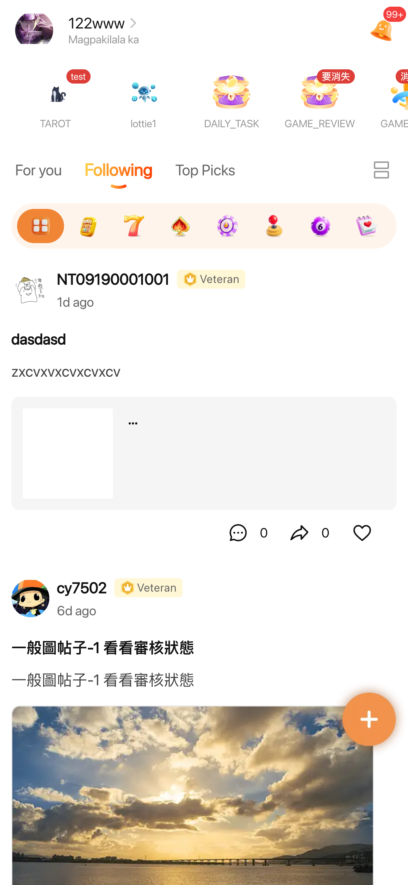 |

玩家可由首頁右上角的視圖切換按鈕在兩種瀑布流之間切換。

**多圖貼文呈現（詳情頁）**：一篇 post 含多張圖片時，玩家可在詳情頁橫向 / 縱向切換瀏覽。

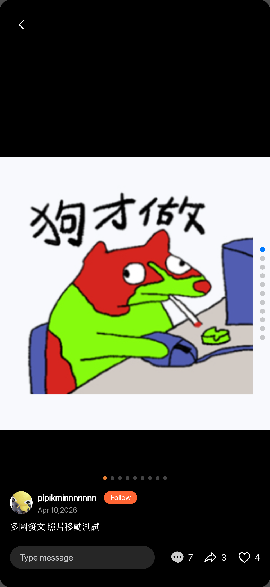

---

### 2.3 互動與社交：讚 / 評論 / 分享 / 收藏 / 追蹤

**商業價值**：UGC 增量 / 社交網絡密度 / 病毒散播

玩家瀏覽內容時，五種互動行為決定社群活力：

| 互動 | 玩家動機 | 商業意義 |
|---|---|---|
| **點讚** | 快速表達喜歡 | 內容熱度信號（影響推薦） |
| **評論** | 深度表達意見、參與討論 | 內容深度互動、UGC 增量 |
| **分享** | 把內容轉發給朋友 / 外站 | 病毒散播、拉新入口 |
| **收藏** | 留存稍後再看 | 用戶資產累積 |
| **追蹤** | 持續關注某創作者 | 創作者粉絲化、回訪驅動 |

**關鍵設計**  
- 點讚有**動畫回饋**（愛心彈出），強化即時滿足感
- 評論可在帖子內展開回應與互動
- 分享支援站內分享、站外分享（以短網址呈現）、贏分截圖三種模式
- 玩家追蹤其他人後：自己的「追蹤」分頁會出現該創作者新動態；對方則會在「新粉絲」分頁看到自己被誰追蹤

**互動行為的入口**多在瀑布流卡片下方（讚 / 評論計數）、沉浸式右下按鈕、詳情頁的互動區塊。

**沉浸式畫面（含底部互動按鈕） / 詳情頁**

| 沉浸式（短影片） | 詳情頁（圖文） |
|---|---|
|  | 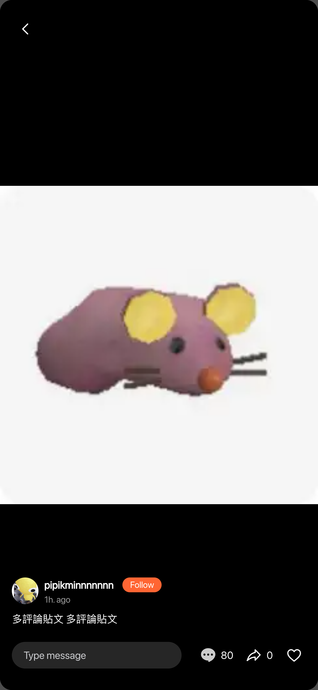 |

---

### 2.4 創作與發佈：誰會發內容、發什麼、發完去哪

**商業價值**：UGC 內容供給 / PUGC 創作者激勵

**誰會發**  
- 重度玩家分享遊戲心得、贏分時刻
- PUGC 創作者經營粉絲、累積影響力
- 運營邀請的 KOL 帶動主題

**發什麼**  
- 圖文帖子（搭配遊戲類型標籤）
- 短影片（含遊戲類型標籤）
- 合集（將多篇內容打包成系列）

**發佈流程**

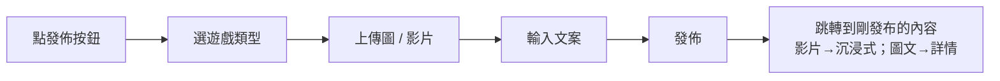
```mermaid
flowchart LR
    A[點發佈按鈕] --> B[選遊戲類型]
    B --> C[上傳圖 / 影片]
    C --> D[輸入文案]
    D --> E[發佈]
    E --> F["跳轉到剛發布的內容<br/>影片→沉浸式；圖文→詳情"]
```

**發佈介面**：標題、文案、分類標籤（遊戲帖 / 生活動態）、照片 / 影片 上傳、投票工具選項

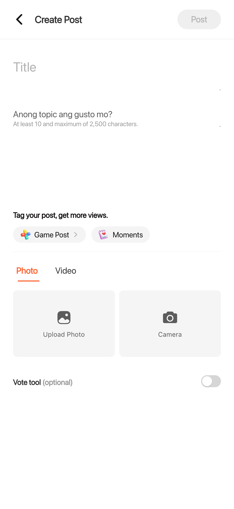

---

### 2.5 任務與獎勵：每日任務 → 領獎 → 財富中心

**商業價值**：DAU / 留存

這是**留存的核心引擎**。透過任務目標 + 獎勵的循環，把「來看內容」的玩家轉為「每天回來簽到」的玩家。

**任務狀態流轉**

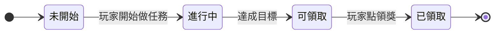
```mermaid
stateDiagram-v2
    direction LR
    [*] --> 未開始
    未開始 --> 進行中: 玩家開始做任務
    進行中 --> 可領取: 達成目標
    可領取 --> 已領取: 玩家點領獎
    已領取 --> [*]
```

**任務類型**  
- **每日任務**：每天重置，例：瀏覽 N 個內容、點讚 N 次、發 1 則動態
- **連續任務**：連續打卡的長線任務
- **特定主題任務**：搭配運營活動的限時任務

**領獎體驗**  
- 任務狀態變化時**主動彈出提示**（達成目標、可領獎時系統會即時告知，避免玩家錯過獎勵）
- 任務列表中已領取與可領取的任務以不同按鈕樣式區分，引導玩家完成下一步動作
- 領取後跳轉**財富中心**查看獎勵餘額

**每日任務畫面**：頂部獎金池、任務列表、依任務狀態顯示「可領獎」或「前往」按鈕、時間軸與進度

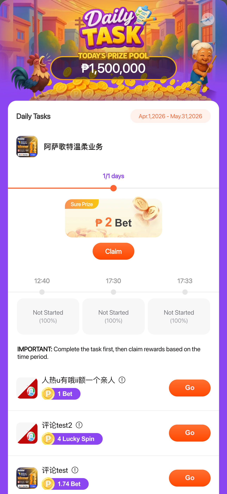

---

### 2.6 通知與召回：通知中心、全場景訊息、紅點

**商業價值**：召回率 / 訊息觸達 / 喚醒沉睡

**通知中心結構**：頂層有兩個 Tab（**頻道** / **訊息**），「訊息」Tab 內再分 3 個入口。

| 層級 | 名稱 | 內容 | 商業價值 |
|---|---|---|---|
| 頂層 Tab | **頻道（Channel）** | 玩家關注的遊戲 / 主題頻道列表，含更新提示 | 創作者粉絲化、主題運營 |
| 頂層 Tab | **訊息（Chat）** | 與其他玩家 / 自己內容相關的 3 類訊息入口（見下方） | — |
| 訊息 Tab 內 | **新粉絲** | 誰追蹤了你（含「回追蹤」按鈕） | 創作者激勵 |
| 訊息 Tab 內 | **互動通知** | 你發的內容收到的讚 / 評論等內容互動回饋 | 內容互動回饋 |
| 訊息 Tab 內 | **系統通知** | 官方公告、版本更新、帳號審核結果（如發文 / 頭像審核） | 用戶教育 |

**紅點機制**  
- 通知中心頂層 Tab 與「訊息」Tab 內各入口皆有未讀紅點
- 點進去後對應分頁紅點清除
- 未讀數即時更新

**全場景訊息與通知**  
- 玩家在社群模組的**任意頁面**都能即時收到「站內訊息」（不限於通知頁）
- 覆蓋形式：站內彈出提示、訊息列表更新、紅點刷新
- **範圍邊界**：以上指「站內訊息」，玩家需在 App 前台時才會收到；OS 層的「系統推播」由主站統一管理（頻控、配額等規則見 5.4）

**通知中心畫面**

| 頻道 Tab（頻道列表） | 訊息 Tab（3 個入口） |
|---|---|
| 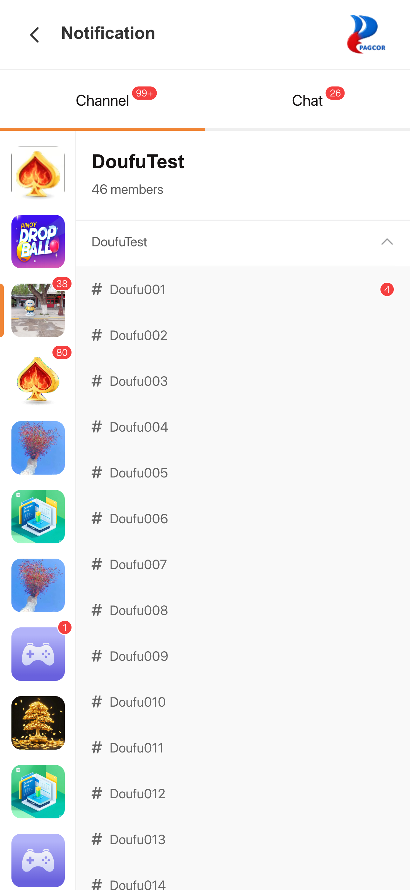 | 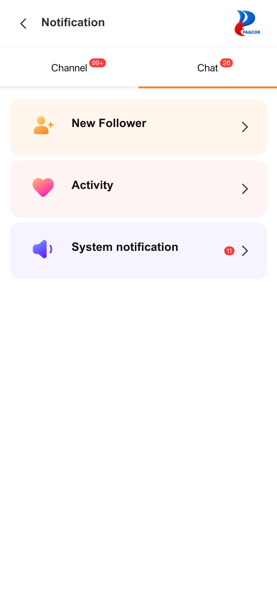 |

| 新粉絲列表 | 互動通知（內容互動回饋） |
|---|---|
| 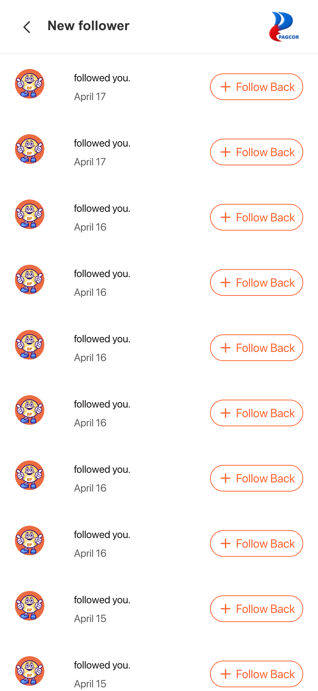 | 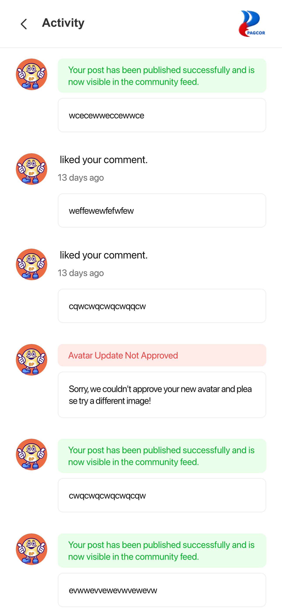 |

---

### 2.7 個人中心：身份標識與社交資產

**商業價值**：身份歸屬 / 社交資產展示

玩家在個人中心看到自己的：
- 頭像、暱稱、ID、等級徽章（如資深會員）
- 追蹤 / 粉絲數、發文數
- 發過的內容（圖文 / 影片 / 合集）列表


**自己 vs 他人個人主頁**

| 自己主頁（含發文 / 編輯個資入口） | 他人主頁（含追蹤 / 取消追蹤按鈕） |
|---|---|
| 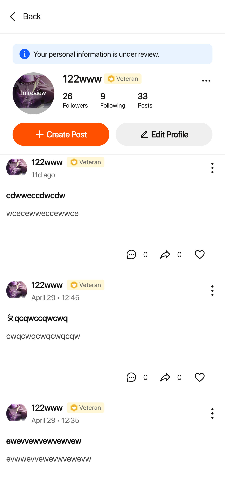 | 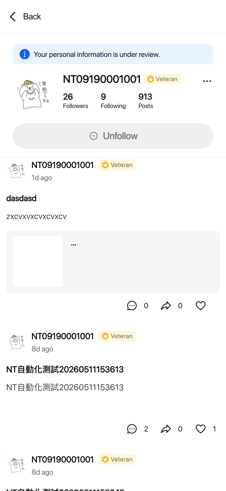 |

**編輯個人資料畫面**

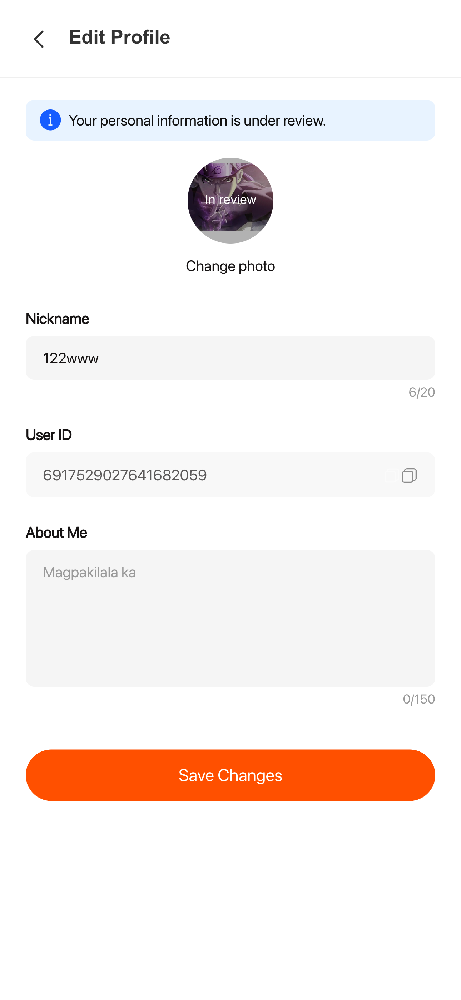

---

### 2.8 主題活動與營銷裂變

**商業價值**：拉新邀請 / 季節性運營 / IP 合作 / 活動轉化

這是社群模組的**運營戰場**。透過一系列主題活動把不同類型的玩家拉進來、留下來、分享出去。

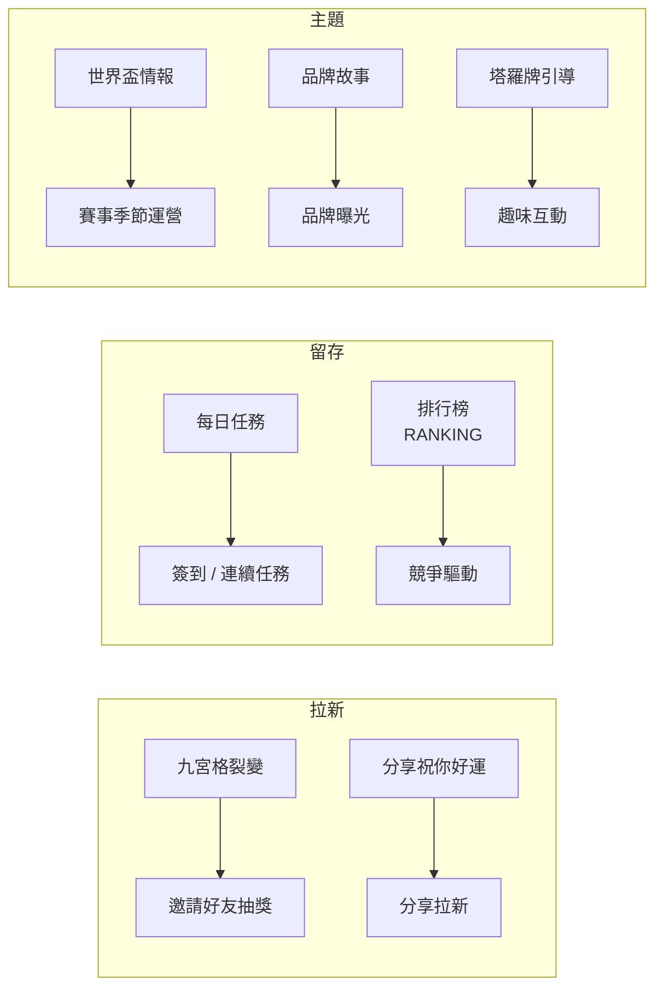
```mermaid
flowchart LR
    subgraph 拉新
    A[九宮格裂變] --> A1[邀請好友抽獎]
    B[分享祝你好運] --> B1[分享拉新]
    end
    subgraph 留存
    C[每日任務] --> C1[簽到 / 連續任務]
    D[排行榜<br/>RANKING] --> D1[競爭驅動]
    end
    subgraph 主題
    E[世界盃情報] --> E1[賽事季節運營]
    F[品牌故事] --> F1[品牌曝光]
    H[塔羅牌引導] --> H1[趣味互動]
    end
```

**主要活動類型**

| 活動 | 用途 |
|---|---|
| **金剛區（首頁頂部活動入口 Banner）** | 常駐運營活動的統一容器，可橫向滑動，含以下 5 個入口 |
| **塔羅牌（TAROT）** | 金剛區入口，新手趣味互動 |
| **每日任務（DAILY_TASK）** | 金剛區入口，留存核心引擎 |
| **遊戲測評（GAME_REVIEW）** | 金剛區入口，玩家對遊戲的評價內容 |
| **遊戲偏好分析（GAME_DNA）** | 金剛區入口，建立個人遊戲偏好標籤 |
| **排行榜（RANKING）** | 金剛區入口，玩家排名與競爭運營 |
| **九宮格裂變** | 邀請拉新核心活動 |
| **分享祝你好運** | 社交分享拉新 |
| **品牌故事專區** | 品牌曝光與用戶教育 |
| **世界盃情報專區** | 季節性主題運營（僅賽事期間展示） |
| **Carlo 主題活動** | 人物 IP 合作 |

**金剛區各入口畫面**

| 塔羅牌（TAROT） | 遊戲測評（GAME_REVIEW） |
|---|---|
| 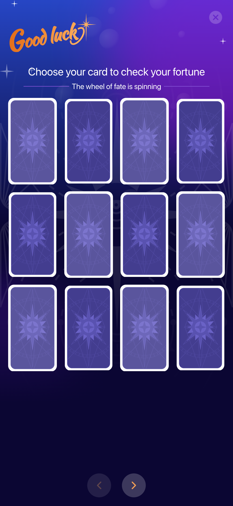 | 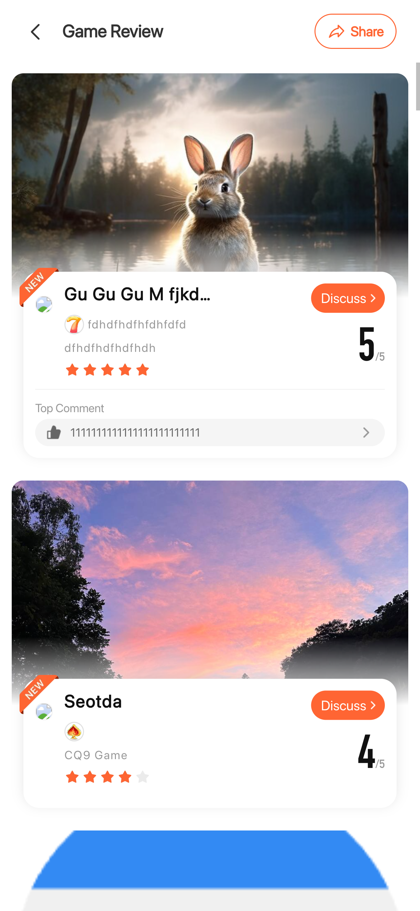 |

| 排行榜（RANKING） | 遊戲偏好分析（GAME_DNA） |
|---|---|
| 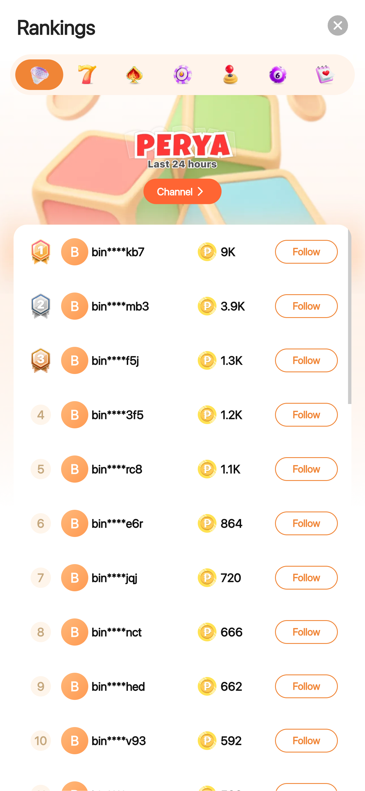 | 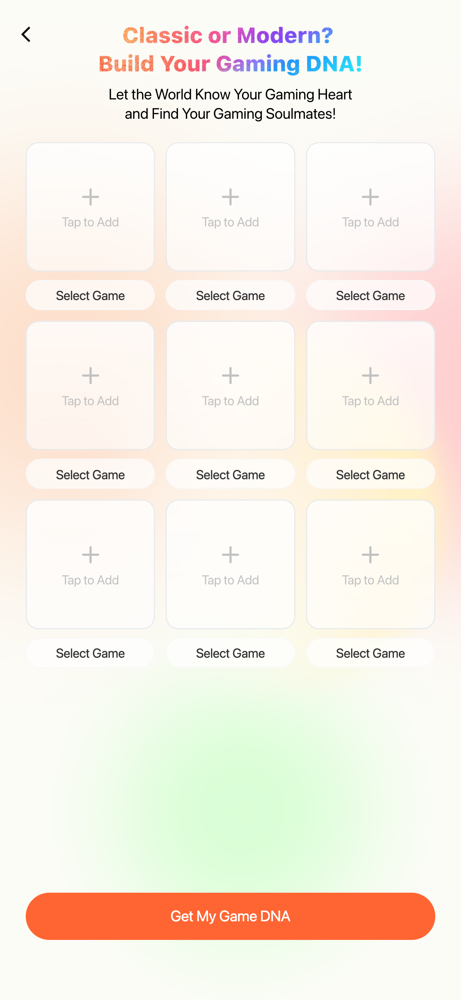 |

**品牌故事專區**

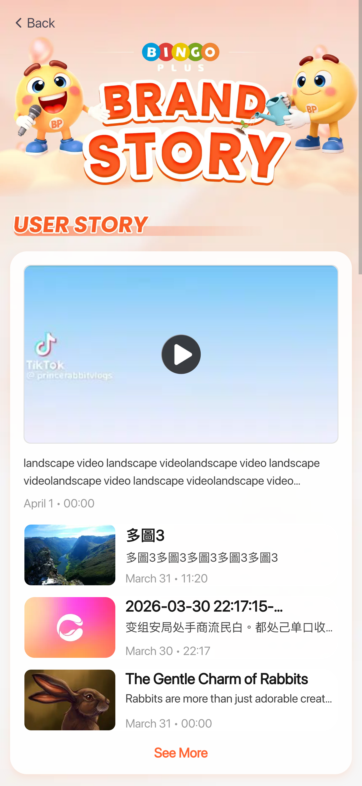

---

## 3. PM 維度 — 功能模組地圖

> 本章以「**商業功能群**」分類（不依工程模組結構），方便 PM 掌握產品資產地圖。每群固定三欄：① **商業目的** ② **使用者價值** ③ **目前能做什麼**。

### 3.0 功能群關係總覽

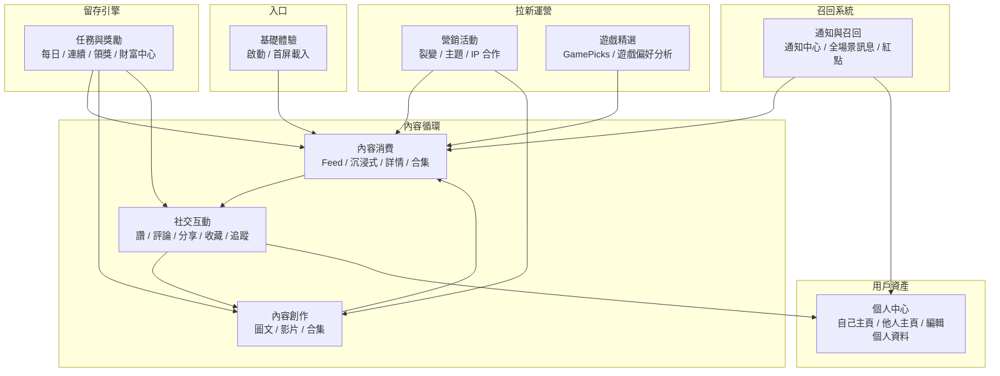
```mermaid
graph TB
    subgraph 入口
    LP[基礎體驗<br/>啟動 / 首屏載入]
    end

    subgraph 內容循環
    CC[內容消費<br/>Feed / 沉浸式 / 詳情 / 合集]
    CR[內容創作<br/>圖文 / 影片 / 合集]
    SI[社交互動<br/>讚 / 評論 / 分享 / 收藏 / 追蹤]
    end

    subgraph 留存引擎
    TR[任務與獎勵<br/>每日 / 連續 / 領獎 / 財富中心]
    end

    subgraph 召回系統
    NT[通知與召回<br/>通知中心 / 全場景訊息 / 紅點]
    end

    subgraph 用戶資產
    PC[個人中心<br/>自己主頁 / 他人主頁 / 編輯個人資料]
    end

    subgraph 拉新運營
    MA[營銷活動<br/>裂變 / 主題 / IP 合作]
    GP[遊戲精選<br/>GamePicks / 遊戲偏好分析]
    end

    LP --> CC
    CC --> SI
    SI --> CR
    CR --> CC
    TR --> CC
    TR --> CR
    TR --> SI
    NT --> CC
    NT --> PC
    SI --> PC
    MA --> CC
    MA --> CR
    GP --> CC
```

**讀圖要點**：基礎體驗是進場入口；**內容循環**（消費 ⇄ 創作 ⇄ 互動）是核心引擎；**任務獎勵**強化所有循環行為；**通知召回**把流失用戶拉回循環；**營銷活動**對外拉新並導入循環；**個人中心**是社交資產沉澱。

---

### 3.1 內容消費

| 欄位 | 內容 |
|---|---|
| **① 商業目的** | 提升留存、瀏覽時長、內容黏著（核心 KPI 承載） |
| **② 使用者價值** | 在主站之外得到放鬆 / 娛樂 / 資訊收集的內容體驗 |
| **③ 目前能做什麼** | 首頁瀑布流推薦、頂部分類切換、沉浸式短影片、圖文詳情頁、合集連續瀏覽、滑到底自動載入 |

---

### 3.2 內容創作

| 欄位 | 內容 |
|---|---|
| **① 商業目的** | UGC 內容供給、創作者激勵、社群活力 |
| **② 使用者價值** | 玩家可發表遊戲心得、分享贏分時刻、經營粉絲 |
| **③ 目前能做什麼** | 圖文發佈、短影片上傳、合集編輯、遊戲類型標籤、投票工具掛載、發佈後導回剛發布的內容（影片→沉浸式；圖文→詳情） |

---

### 3.3 社交互動

| 欄位 | 內容 |
|---|---|
| **① 商業目的** | 提升社交網絡密度、UGC 增量、外部分享拉新 |
| **② 使用者價值** | 表達情緒、參與討論、與他人連結、累積社交資產 |
| **③ 目前能做什麼** | 點讚（含愛心動畫）、評論（含子留言、表情、@提及）、收藏、追蹤、新粉絲提醒、分享（站內 / 站外短網址 / 贏分截圖） |

---

### 3.4 任務與獎勵

| 欄位 | 內容 |
|---|---|
| **① 商業目的** | DAU、留存、活躍度（留存核心引擎） |
| **② 使用者價值** | 完成簡單行為換取獎勵、累積成就感 |
| **③ 目前能做什麼** | 每日任務、連續任務、特定主題任務、可領取狀態主動彈出提示、領獎跳轉財富中心 |

---

### 3.5 通知與召回

| 欄位 | 內容 |
|---|---|
| **① 商業目的** | 提升召回率、訊息觸達、喚醒沉睡用戶 |
| **② 使用者價值** | 不錯過追蹤對象的動態、即時得到訊息與系統公告 |
| **③ 目前能做什麼** | 頻道訂閱（關注 / 取消關注遊戲或主題頻道）、頻道更新提示、通知中心兩層架構：頂層「頻道 / 訊息」兩個 Tab，「訊息」Tab 內含新粉絲 / 互動通知 / 系統 3 個入口、紅點未讀更新、全場景站內訊息覆蓋（任意頁面都能收訊）、即時站內提示 |

---

### 3.6 個人中心

| 欄位 | 內容 |
|---|---|
| **① 商業目的** | 身份歸屬、社交資產展示、創作者粉絲化 |
| **② 使用者價值** | 看到自己的足跡與成就、被他人快速了解 |
| **③ 目前能做什麼** | 個人主頁（自己 + 他人，含頭像、暱稱、ID、會員徽章、追蹤 / 粉絲數、發文列表）、編輯個人資料（含資料審核狀態） |

---

### 3.7 營銷活動

| 欄位 | 內容 |
|---|---|
| **① 商業目的** | 拉新邀請、季節性運營、IP 合作、品牌曝光 |
| **② 使用者價值** | 抽獎、參與主題活動、看到品牌故事、競爭排名 |
| **③ 目前能做什麼** | 九宮格裂變、分享祝你好運、品牌故事專區、排行榜、塔羅牌引導、Carlo 主題活動、世界盃情報專區（賽事期間） |

---

### 3.8 遊戲精選

| 欄位 | 內容 |
|---|---|
| **① 商業目的** | 跨模組導流（社群 → 主站）、轉化主站開局率 |
| **② 使用者價值** | 看到精選遊戲、依個人偏好得到遊戲推薦 |
| **③ 目前能做什麼** | 遊戲精選列表（GamePicks）、遊戲類型分類；導至主站遊戲詳情，社群側顯示相關帖子聚合 |

---

### 3.9 基礎體驗

| 欄位 | 內容 |
|---|---|
| **① 商業目的** | 性能體感、商業數據準確度、用戶體驗下限保障 |
| **② 使用者價值** | 進場快、操作順、不卡頓、行為被正確記錄 |
| **③ 目前能做什麼** | 啟動體驗達標、首頁版位穩定、瀏覽時長精準度、行為數據準確記錄、外部連結可直達內容詳情 |

---

## 4. 半年累積能力總覽

> 不講過程、不講月份。回答一個問題：**現在這個產品累積了什麼能力？**
>
> 以下清單按「商業功能層級」分群，列出目前實際上線可用的能力。

### 4.1 內容層
- 首頁視圖：雙欄 / 單欄兩種瀑布流（右上角可切換），含分類列、精選分頁、追蹤分頁
- 沉浸式短影片播放（上下滑切換、右側互動按鈕）
- 圖文 / 影片詳情頁
- 多圖貼文呈現（一篇 post 含多張圖片時，可橫向 / 縱向切換）
- 合集瀏覽（多篇打包成系列）
- 內容外部連結直達（特定內容可由外部連結直接進入）

### 4.2 創作層
- 圖文發佈（含遊戲類型標籤；可分為「遊戲帖」與「生活動態」兩類）
- 短影片上傳
- 合集編輯（創作者可組織內容）
- 發佈後自動導回剛發佈的內容（影片→沉浸式；圖文→詳情）
- 贏分內容分享（玩家可將遊戲贏分截圖分享至社群）
- 投票工具（可選掛載於發文中）

### 4.3 互動與社交層
- 點讚（含愛心動畫即時回饋）
- 評論（含子留言、表情、@ 提及）
- 收藏
- 追蹤、新粉絲提醒
- 分享：站內、站外短網址、贏分截圖三種模式

### 4.4 任務與獎勵層
- 每日任務（任務列表、進度展示、領獎彈窗）
- 連續任務（多階段累積打卡）
- 特定主題任務（搭配運營活動的限時任務）
- 任務風控評估（防刷單）
- 任務狀態主動站內提示（達成 / 可領 / 已領，即時提醒）
- 領獎跳轉財富中心（餘額顯示由主站維護）

### 4.5 通知與召回層
- 通知中心兩層架構：頂層「頻道 / 訊息」兩個 Tab，「訊息」Tab 內含新粉絲 / 互動通知 / 系統 3 個入口
- 紅點未讀計數
- 站內訊息全場景覆蓋（玩家在社群任意頁面都能即時收訊）
- 系統推播由主站統一管理（頻控、配額、退訂規則由主站決定）

### 4.6 個人中心層
- 個人主頁（自己版本：含「發文 / 編輯個資」入口；他人版本：含「追蹤 / 取消追蹤」按鈕）
- 編輯個人資料（含資料審核狀態）

### 4.7 營銷活動層
- **金剛區**（首頁頂部活動入口 Banner，可橫向滑動，含以下 5 個入口）：
  - 塔羅牌（TAROT）：新手趣味互動
  - 每日任務（DAILY_TASK）：留存核心引擎
  - 遊戲測評（GAME_REVIEW）：玩家對遊戲的評價內容
  - 遊戲偏好分析（GAME_DNA）：建立個人遊戲偏好標籤
  - 排行榜（RANKING）：玩家排名與競爭運營
- 九宮格裂變（拉新核心）
- 分享祝你好運（社交分享拉新）
- 品牌故事專區（品牌曝光與用戶教育）
- Carlo 主題活動（人物 IP 合作）
- 世界盃情報專區（季節性運營，僅賽事活動期間展示）

### 4.8 遊戲精選層
- 遊戲精選列表（GamePicks）
- 遊戲類型分類
- 導至主站遊戲詳情；社群側顯示相關帖子聚合

### 4.9 基礎體驗層
- 啟動體驗
- 首頁版位穩定
- 行為數據準確記錄（為運營分析提供依據）
- 有效觀看計算（用於內容推薦與創作激勵）
- 外部連結可直達內容詳情

---

## 5. 產品邊界與限制

> 不講技術邊界，講「PM 設計功能時必須知道」的產品 / 商業邊界。

### 5.1 身份與權限：依附主站

- **無獨立帳號**：玩家身份由主站帶入，社群內不可獨立註冊 / 登入
- **登入流程零摩擦**：玩家不會在社群內遇到任何登入頁
- **影響設計**：拉新動作的最終承接者是主站；社群活動的拉新動能最終會匯入主站開戶率

### 5.2 內容類型

目前產品支援的內容類型：
- ✅ 圖文帖子
- ✅ 短影片
- ✅ 合集（多篇內容打包）
- ✅ 贏分截圖分享
- ❌ 長影片（不支援）
- ❌ 純文字長文（不支援）

### 5.3 上線節奏（灰度 → 正式）

新功能上線會走「灰度 → 正式」兩階段：
- **灰度期**：先對小比例用戶開放，觀察數據與體驗
- **正式期**：通過灰度評估後全量發佈

對 PM 的意義：**新功能規劃時要預留灰度觀測期**，不能假設一上線即觸達全量用戶。每月會有一個發佈批次，依此節奏對齊運營排期。

### 5.4 跨模組依賴

社群模組對主站有以下依賴（PM 規劃功能時需確認跨團隊協作）：
- **用戶身份系統**：主站維護
- **獎勵 / 財富帳本**：主站維護（社群只展示）
- **遊戲列表 / 詳情**：主站維護
- **支付 / 兌換**：主站維護
- **OS 層系統推播通道**：主站統一管理（社群只發站內訊息；系統推播的頻控、配額、退訂規則由主站決定）

## 6. 附錄

### 6.1 名詞表

| 名詞 | 解釋 |
|---|---|
| **金剛區** | 首頁頂部一橫排的活動入口 Banner，常駐運營活動（如 TAROT / 每日任務 / 遊戲測評）的統一入口；部分入口帶 Hot / New 等狀態標籤 |
| **塔羅牌（TAROT）** | 常駐於金剛區的新手趣味互動入口 |
| **排行榜（RANKING）** | 常駐於金剛區，呈現玩家排名與競爭運營 |
| **遊戲測評（GAME_REVIEW）** | 玩家對遊戲的評價內容類型，由金剛區常駐入口進入 |
| **內容流（Feed）** | 首頁滑動瀏覽的內容列表 |
| **頻道（Channel）** | 通知中心頂層 Tab 之一，呈現玩家關注的遊戲 / 主題頻道更新 |
| **訊息（Chat）** | 通知中心頂層 Tab 之一，含新粉絲 / 互動通知 / 系統通知 3 個入口 |
| **瀑布流** | 不等高卡片左右錯落排列的內容呈現方式 |
| **沉浸式** | 全屏播放單一內容的瀏覽模式（類短影片直立全屏播放） |
| **短影片** | 短時長影片內容（亦稱 Shorts） |
| **合集** | 創作者將多篇內容打包成一組的功能 |
| **詳情頁** | 點擊圖文後展開的完整閱讀頁 |
| **UGC（用戶生成內容）** | 由玩家自行創作的圖文 / 影片內容 |
| **PUGC（專業用戶生成內容）** | 有經營性質的創作者所產的內容（介於 UGC 與 PGC 之間） |
| **裂變** | 透過用戶分享邀請新用戶的拉新機制 |
| **召回** | 將流失或沉睡用戶帶回 App |
| **紅點** | 提示用戶有未讀 / 未完成事項的小標記 |
| **追蹤 / 粉絲** | **「人 → 人」**的關注關係。玩家追蹤其他玩家（被追蹤者累積為粉絲）。展現於首頁「追蹤」分頁、通知中心「新粉絲」入口 |
| **頻道 / 訂閱** | **「人 → 主題」**的關注關係。玩家可關注特定遊戲 / 主題頻道，新內容更新時於通知中心「頻道」Tab 呈現 |
| **站內訊息** | 玩家在 App 前台時收到的即時訊息（含追蹤動態、活動提醒、互動回饋等）— 不等於 OS 層的系統推播 |
| **系統推播** | OS 層的推播通知（App 在背景時也會收到）— 由主站統一管理，社群只負責站內訊息 |
| **任務狀態** | 未開始 → 進行中 → 可領取 → 已領取 |
| **財富中心** | 玩家獎勵餘額與兌換入口 |
| **分享祝你好運** | 一種社交分享拉新活動形態 |
| **九宮格裂變** | 主要拉新活動形態：邀請好友抽獎 |
| **遊戲偏好分析（Game DNA）** | 分析玩家遊戲偏好，用於個人化推薦的運營機制 |
| **灰度** | 新功能對小比例用戶開放、觀察數據後再全量發佈的階段 |

### 6.2 內部對外名稱對照（給跨團隊協作參考）

> 工程實作與設計稿可能使用以下英文代號；對外文案、PM 規格、主管簡報請使用左側中文名。

| 對外中文名 | 內部代號 |
|---|---|
| 瀑布流佈局 | Masonry Layout |
| 合集 | Collection |
| 遊戲帖 | Game Post |
| 生活動態 | Moments |
| 投票工具 | Vote Tool |
| 贏分分享 | GameWin / Share Win |
| 分享祝你好運 | ShareLuck |
| 品牌故事專區 | Brand Story |
| 財富中心 | WealthCreation |
| 遊戲精選 | GamePicks |
| 遊戲偏好分析 | Game DNA |
| 連續任務 | ContinuousDailyTasks |
| 九宮格裂變 | NineGridFission |
| 全場景訊息與通知 | IMPushFullScene |
